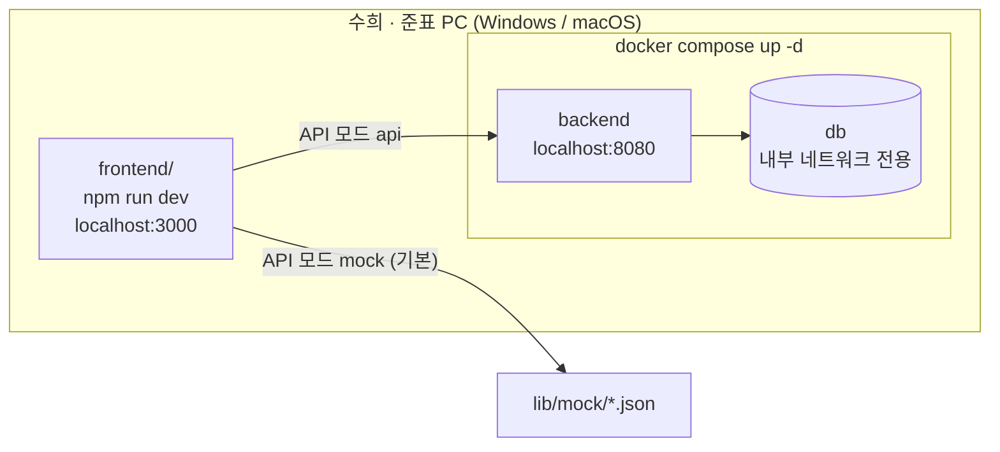
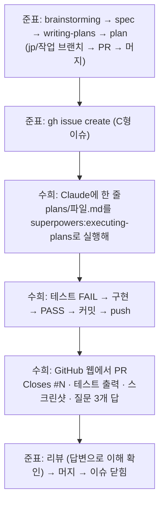

# 협업 체계 설계 (1번 덩어리)

작성: 2026-09-16, 준표. brainstorming 대화에서 결정한 것을 정리했다. 결정은 모두 준표가 A/B/C 중에서 골랐다.

> ## 2026-09-17 변경 — 이 절이 아래 본문보다 우선한다
>
> 아래 본문과 다르면 이 절과 실제 규칙 파일([`AGENTS.md`](../../../AGENTS.md), [`docs/`](../../))이 맞다.
>
> | 항목 | 본문 (09-16) | 변경 (09-17) | 근거 |
> |---|---|---|---|
> | AI 도구 | 수희 = Claude Code 전제 | **이재원·조수희 = Codex, 봉준표만 Claude Code** | 준표 확인 |
> | 규칙 파일 | `CLAUDE.md` 원본 + `(site)/CLAUDE.md` | **`AGENTS.md` 원본**, `CLAUDE.md`는 `@AGENTS.md`만 | Codex는 `AGENTS.md`를 읽는다 |
> | 조수희 역할 | `app/(site)/` 페이지 | **`components/interaction/`** — GSAP 스크롤 · 발색 비교 · 씬 파라미터 (3D 뼈대는 준표가 먼저) | 기획서 수정본 5-2 · 결정 1C |
> | 봉준표 역할 | 공통 · 3D 스토리 씬 | 정보구조 · Figma · **페이지** · WebGL 뼈대 · 이슈 · 머지 | 기획서 수정본 5-2 |
> | 백엔드 | 별도 서비스 · Docker · 8080 | **Next.js 서버 API(`frontend/app/api/`) + Sanity + Supabase + Vercel**, `backend/` = Sanity Studio · Supabase 마이그레이션 | 기획서 수정본 5-1 · 결정 2A |
> | Docker | 백엔드·DB용 | **불필요** (호스팅 서비스). 로컬 Supabase는 이재원 선택 | 위 변경의 결과 |
> | 브랜치 이름 | `jp/` · `sh/` · `jw/` | **`<종류>/<영역>-<설명>`** (영역 `front`·`interaction`·`back`) | graduation_cap 방식 |
> | 작업 요청 | C형 이슈 | C형 이슈 + **이슈 없이 시작 금지** + 이슈 닫힘 = 브랜치 삭제(`delete_branch_on_merge`) | 준표 지시 |
> | main 보호 | 규칙 문서 | **`.githooks/` pre-push**가 main 직접 push · force push 거부. 서버 보호는 Pro 인증 후 | 2026-09-16 main 직접 push 사고 |
> | 머지 | 준표만 | **준표 단독, 대신 머지하는 사람 없음** | 준표 지시 |

## 배경

- 과제 "빛이 남기는 색"의 범위가 **팔찌에서 팔찌 + 목걸이**로 넓어졌다.
- 브랜드 사이트는 세 사람이 만든다.

| 사람 | GitHub | 담당 | 비고 |
|---|---|---|---|
| 준표 | bongjunpyo | 프론트엔드 · 설계 · 작업지시 · 머지 | macOS |
| 조수희 | whtngml18 | 프론트엔드 페이지 | 2학년, 개발 경험 없음, **Windows** |
| 이재원 | leejaewon23 | 백엔드 | 스택 미정 (이재원이 선택) |

- 수희에게는 2026 오픈소스 개발자대회에서 김태경에게 쓴 작업지시 방식을 그대로 적용한다.
  원본은 `~/opensource_contest_tmax`의 `CLAUDE.md`, `parser/CLAUDE.md`, `docs/PROMPTS.md`, `docs/INTERFACES.md`, `docs/superpowers/`.

## 전체 분해

이 요청은 세 덩어리로 나눈다. 덩어리마다 spec → plan → 구현을 따로 거친다.

| 순서 | 덩어리 | 내용 |
|---|---|---|
| 1 | **협업 체계 (이 문서)** | 레포 구조 · 담당 폴더 · 규칙 파일 · 개발 환경 · 작업지시 흐름 |
| 2 | 데이터 모델 | 팔찌 → 팔찌 + 목걸이. INTERFACES의 제품 계약과 mock 데이터 |
| 3 | 스토리 씬 | 아이소메트릭 보드 + 중앙 태양 + 팔찌·목걸이 배치 (3D) |

목걸이가 추가되면서 기획서 과제명과 재료 예산("팔찌 10개")도 바뀌어야 한다. 웹 작업과는 별도로 처리한다.

## 목표

1. 수희가 **이재원을 기다리지 않고** 첫날부터 화면을 띄우고 테스트 PASS를 볼 수 있다.
2. 수희의 Claude가 **정해진 폴더와 정해진 이름** 밖으로 나가지 않는다.
3. 수희가 받는 이슈만 읽어도 무엇을, 어느 파일에, 어떤 이름으로 만드는지 알 수 있다.
4. Windows와 macOS에서 명령어와 결과가 같다.

## 결정 기록

| # | 질문 | 선택 | 고르지 않은 안 |
|---|---|---|---|
| Q1 | 레포 구조 | 한 레포에 frontend/ · backend/ · docs/ | 레포 두 개 |
| Q2 | Docker 범위 | 백엔드 + DB만 Docker, 프론트는 호스트에서 `npm run dev` | 프론트까지 Docker (Next 16 공식 문서: Windows·macOS에서 Fast Refresh 지연) |
| Q3 | 프론트 시작 방식 | `frontend/` 새로 생성, `web-demo/`는 교재로 동결 | web-demo를 frontend로 승격 |
| Q4 | 프론트 담당 경계 | 페이지 단위 | 기술 종류 단위 · 이슈마다 파일 지정 |
| Q5 | 수희 이슈 형식 | C형: 명세 표 + plan 링크 + 학습 섹션 | 이슈에 전부 · 표 + plan만 |
| Q6 | 백엔드 계약 | 문서 계약 + mock 데이터 먼저 | 문서만 · OpenAPI 자동 생성 (이재원 스택 확정 후 재검토) |
| Q7 | 완료 확인 | lib는 `node --test`, 페이지는 Playwright 스모크 (FAIL → PASS) | 빌드 + 눈 확인 · 로직만 테스트 |
| S1 | 머지 권한 | **모든 PR은 준표가 머지** | backend/만 이재원 셀프 머지 |
| S2 | 스타일 | CSS Modules + 디자인 토큰 CSS 변수 | Tailwind v4 · 공통 컴포넌트 조합만 |
| S3 | Node 버전 고정 | 공식 설치 파일 + `engines` + `engine-strict=true` | nvm-windows · Volta |
| S4 | 이슈·PR 양식 위치 | `.github/ISSUE_TEMPLATE/` + `.github/pull_request_template.md` | docs 문서만 · Issue Forms(yml) |

## 1. 레포 구조와 담당

```
Sunny/
├─ CLAUDE.md
├─ .gitignore
├─ .gitattributes
├─ docker-compose.yml
├─ .github/
│  ├─ ISSUE_TEMPLATE/sh-task.md
│  ├─ ISSUE_TEMPLATE/config.yml
│  └─ pull_request_template.md
├─ docs/
│  ├─ INTERFACES.md
│  ├─ PROMPTS.md
│  ├─ ONBOARDING.md
│  ├─ THIRD_PARTY.md
│  └─ superpowers/
│     ├─ README.md
│     ├─ specs/
│     └─ plans/
├─ backend/
├─ frontend/
│  ├─ app/
│  │  ├─ layout.tsx
│  │  ├─ page.tsx
│  │  ├─ globals.css
│  │  ├─ story/
│  │  └─ (site)/
│  │     └─ CLAUDE.md
│  ├─ components/common/
│  ├─ lib/
│  ├─ e2e/
│  │  ├─ smoke.spec.ts
│  │  ├─ site/
│  │  └─ story/
│  └─ tests/
└─ web-demo/
```

| 경로 | 담당 | 내용 |
|---|---|---|
| `CLAUDE.md`, `.gitignore`, `.gitattributes`, `.github/` | 준표 | 팀 규칙 · 양식 |
| `docs/` 전체 | 준표 | `INTERFACES.md`는 준표 · 이재원 합의 후 준표가 반영 |
| `docs/superpowers/` | 준표 작성 | 수희는 읽고 plan 범위 안에서만 실행 |
| `docker-compose.yml`, `backend/` | 이재원 | 스택 자유. 아래 "이재원과의 계약"만 지킨다 |
| `frontend/app/layout.tsx`, `page.tsx`, `globals.css` | 준표 | 공통 레이아웃 · 홈 · 디자인 토큰 |
| `frontend/app/story/` | 준표 | 3D 스토리 씬 (3번 덩어리) |
| `frontend/app/(site)/` | **수희** | collection · compare · custom · archive 페이지 |
| `frontend/components/common/` | 준표 | 헤더 · 레이아웃 부품 |
| `frontend/lib/` | 준표 | 타입 · `api.ts` · `mock/` · 비즈/팔찌/태양 로직 |
| `frontend/e2e/smoke.spec.ts`, `e2e/story/` | 준표 | |
| `frontend/e2e/site/` | **수희** | 자기 페이지 스모크 테스트 |
| `frontend/tests/` | 준표 | `node --test` 단위 테스트 |
| `web-demo/` | 동결 | 수희 교재. 수정 금지 |

루트의 `리서치/`, `photochromic_bracelet_material_budget.html`, 기획서 `.hwpx`, `tools/`는 이번 작업에서 건드리지 않는다.

### 브랜치 · 커밋 · 머지

- 브랜치: `jp/<작업>`(준표), `sh/<작업>`(수희), `jw/<작업>`(이재원). **영문 kebab-case만** 쓴다.
  근거: 대회 때 한글 브랜치명에서 `gh pr create`가 "no history in common"으로 실패했다.
- 새 브랜치는 항상 `git checkout main` → `git pull origin main` → `git checkout -b <브랜치>` 순서로 만든다.
- spec · plan 파일명의 작업명은 브랜치 작업명과 같다. 예: `plans/2026-09-20-collection-card.md` ↔ `sh/collection-card`.
- main 직접 커밋 · force-push · main 히스토리 재작성은 금지한다.
- **모든 PR은 준표가 머지한다** (frontend · backend · docs 구분 없음).
- 커밋 메시지는 한국어: `feat(collection): 제품 카드 목록 표시`.

## 2. 규칙 파일

### 루트 `CLAUDE.md` — 세 사람의 Claude가 모두 읽는다

대회 루트 `CLAUDE.md`를 뼈대로 쓴다. 아래 항목을 담는다.

- **기술 스택 (고정, 다른 스택 제안 금지)**: Next.js 16 App Router · TypeScript · React Three Fiber / drei · GSAP · Node 24 LTS · npm(yarn · pnpm 금지) · CSS Modules. 테스트는 `node --test`와 Playwright. 백엔드는 이재원이 고르고 Docker compose로 실행한다.
- **Next 16 경고**: Claude의 학습 데이터와 API가 다르다. 코드를 쓰기 전에 `frontend/node_modules/next/dist/docs/`에서 해당 가이드를 확인한다.
- **명령어 (Windows · macOS 동일)**: `npm ci`, `npm run dev`, `npm run build`, `npm test`, `npx playwright test`, `docker compose up -d`.
- **담당 표**: 위 1절의 표.
- **작업 규칙**
  1. 구현 전에 계획(수정할 파일 · 함수 · 완료 조건)을 제시하고 승인받는다.
  2. 커밋당 3파일 이하. `package-lock.json`은 `package.json`과 같은 커밋에 넣는다.
  3. 새 라이브러리는 이유와 라이선스를 설명하고 승인받은 뒤 설치하고, `docs/THIRD_PARTY.md`에 1줄 기록한다.
  4. 코드 변경 후 3줄 요약: 무엇을 바꿨나 / 왜 / 어떻게 확인하나.
  5. 테스트를 실제로 실행한 출력 없이 "완료"라고 말하지 않는다.
  6. API 모양을 바꾸려면 `docs/INTERFACES.md` 수정을 먼저 제안한다.
- **보안**
  1. `.env`, `.env.local`은 커밋하지 않는다. 비밀값은 코드 · 문서 · 커밋 메시지 · 이슈 · PR에 쓰지 않는다.
  2. 커밋 전 `git diff --staged`를 확인하고 결과를 보여준다.
  3. mock 데이터와 테스트에 실제 고객 사진 · 이름 · 문구를 넣지 않는다 (커스텀 주문 내용은 개인정보다).
  4. `리서치/`의 타 브랜드 캡처 이미지는 사이트에 쓰지 않는다 (저작권).
  5. `rm -rf`, `git push --force`, `git reset --hard`, `git clean`, 원격 스크립트를 파이프로 바로 실행하는 명령은 실행 전에 사용자에게 확인받는다.
- **금지**: main 직접 커밋 · force-push · 준표 외 머지 · `web-demo/` 수정 · 담당이 아닌 폴더 수정(요청 문장만 출력).

### `frontend/app/(site)/CLAUDE.md` — 수희 가드레일

대회 `parser/CLAUDE.md`를 뼈대로 쓴다. 루트 규칙보다 우선한다.

- **가져다 쓰기만**: `lib/`, `components/common/`, `app/globals.css`는 import만 한다. 고칠 게 있으면 준표에게 보낼 요청 문장을 출력한다.
- **Claude가 지킬 것**
  1. 구현 전에 계획을 3줄 이내로 제시하고 "진행할까요?"라고 물은 뒤 승인받는다.
  2. 한 번에 파일 1개만 수정한다 (테스트 파일 포함 시 2개).
  3. 코드를 쓰면 함수 · 컴포넌트마다 비유 1개로 설명하고, 리뷰에서 물어볼 만한 질문 3개를 제시한다.
  4. 테스트 먼저: `e2e/site/<페이지>.spec.ts`를 작성 → FAIL 확인 → 구현 → PASS 확인.
  5. 완료 선언 전 `npx playwright test e2e/site/<페이지>.spec.ts` 출력을 보여준다.
  6. 요청이 모호하면 추측으로 구현하지 않고 보기 2~3개를 제시해 고르게 한다.
- **프론트 규칙**
  - API는 `lib/api.ts`가 내보내는 함수로만 호출한다. `fetch`를 직접 쓰지 않는다.
  - `three`, `@react-three/*`를 import하지 않는다 (스토리 씬 담당 영역).
  - `"use client"`는 클릭 · 상태가 필요한 파일에만 붙인다.
  - 스타일은 `*.module.css`와 `var(--토큰)`으로만 작성한다. 색 · 글꼴 · 간격 값을 직접 쓰지 않는다.
- **Windows**: PowerShell에서 괄호가 들어간 경로는 따옴표로 감싼다. `cd "frontend/app/(site)"`. 따옴표가 없으면 PowerShell이 괄호를 식으로 해석해 실패한다.
- **하지 않는 것**: 파일 삭제 · `git push` · 머지 · 새 라이브러리 설치. 같은 문제로 대화가 20턴을 넘으면 "`/clear` 후 `docs/PROMPTS.md`의 재시작 템플릿을 쓰세요"라고 안내한다.

### 디자인 토큰

`frontend/app/globals.css`의 `:root`에 CSS 변수로 둔다. 브랜드 시각 체계가 확정되기 전까지는 `web-demo/app/globals.css`의 값을 임시로 쓴다.

```
--paper  --paper-2  --ink  --muted  --line  --sun  --sun-deep  --radius  --gutter
```

브랜드 확정 시 **이름은 유지하고 값만** 바꾼다. 수희 코드는 수정할 필요가 없다.

## 3. 개발 환경

### 실행 구조



### Node · npm

- Node 24 LTS를 nodejs.org 공식 설치 파일로 설치한다.
- `frontend/package.json`에 `"engines": { "node": ">=24 <25" }`, `frontend/.npmrc`에 `engine-strict=true`.
  버전이 다르면 `npm ci`가 `npm error notsup Required: {"node":">=24 <25"}`로 멈춘다 (2026-09-16 실측: engines를 맞지 않게 두면 install이 notsup으로 실패).
- 설치는 `npm ci`만 쓴다 (lock 파일 그대로 설치).

### 줄바꿈

루트 `.gitattributes`에 `* text=auto eol=lf`. Windows에서 CRLF가 커밋되어 diff 전체가 바뀌는 것을 막는다.

### API 모드 (mock 먼저)

| 환경변수 | 값 | 기본값 (없을 때) |
|---|---|---|
| `NEXT_PUBLIC_API_MODE` | `mock` \| `api` (그 밖의 값은 `mock`으로 취급) | `mock` |
| `NEXT_PUBLIC_API_BASE_URL` | 백엔드 주소 | `http://localhost:8080` |

- 아무 설정도 하지 않으면 mock이다. 수희는 첫날 `.env.local` 없이 개발한다.
- `frontend/.env.example`에 키 이름만 커밋한다.
- 이번 덩어리의 `lib/api.ts`는 **모드 판정 함수만** 가진다. 제품 조회 같은 데이터 함수와 `lib/mock/*.json`은 2번 덩어리에서 추가한다.
- 규칙: `INTERFACES.md`의 JSON 예시 = `lib/mock/*.json` = 이재원 API 실제 응답. mock에서 api로 전환하는 날 준표가 세 가지를 대조한다.

### 이재원과의 계약 (`docker-compose.yml`)

- 서비스 이름 `backend`, 호스트 포트 **8080**. 근거: 준표 맥에서 8000을 다른 프로젝트가 쓰고 있다.
- DB 서비스는 호스트 포트를 열지 않는다. 근거: 준표 맥의 5432 충돌 회피.
- `docker compose up -d` 한 번으로 backend와 db가 모두 뜬다.
- 비밀값은 루트 `.env`(커밋 금지)에서 읽고, 키 이름은 루트 `.env.example`에 둔다.
- 이번 덩어리에서는 compose 파일과 backend 내용을 만들지 않는다. 이재원이 위 계약대로 작성한다.

### 테스트

- `npm test` = `node --test`로 `frontend/tests/**/*.test.ts`를 실행한다. 설치 없이 Node 24가 TS를 바로 실행한다 (web-demo `tests/dampUv.test.ts`에서 확인).
  - 테스트 파일은 `import ... from "../lib/api.ts"`처럼 `.ts` 확장자를 붙여 불러온다. 그래서 web-demo처럼 `tsconfig.json`의 `exclude`에 `tests`를 넣는다 (넣지 않으면 `next build` 타입 검사가 확장자 import를 거부한다).
  - `node --test`가 직접 불러오는 `lib/` 파일은 `@/` 별칭을 쓰지 않는다 (Node는 tsconfig 별칭을 모른다).
  - 이번 덩어리의 단위 테스트 `tests/api.test.ts`: API 모드 값이 없으면 `mock`, `"api"`면 `api`, 그 밖의 값이면 `mock`.
- Playwright
  - `@playwright/test`를 개발 의존성으로 설치하고, 최초 1회 `npx playwright install chromium`을 실행한다.
  - `playwright.config.ts`의 `webServer`가 `npm run dev`를 띄우고 `env: { NEXT_PUBLIC_API_MODE: "mock" }`을 넘긴다. `cross-env` 같은 OS별 도구는 쓰지 않는다.
  - 스크린샷은 `e2e/shots/`에 저장하고 gitignore한다. PR에만 첨부한다.
  - WebGL 씬(`/story`)은 페이지가 열리는지만 검사한다.
- 이번 덩어리의 스모크 테스트 `e2e/smoke.spec.ts`: `/`에서 제목 "빛이 남기는 색"이 보이고, `data-testid="api-mode"` 요소의 글자가 `mock`이다.

## 4. 작업지시 흐름



### C형 이슈 양식 — `.github/ISSUE_TEMPLATE/sh-task.md`

순서대로 아래 섹션을 가진다.

| 섹션 | 내용 |
|---|---|
| 무엇을 만드나 | 기능 설명 2~3문장 |
| 브랜치 | `sh/<작업>` + "main 최신화 후 생성" |
| 수정 허용 파일 | 표: 파일 · 새로/수정 · 역할. "이 표에 없는 파일은 만들거나 고치지 않는다" |
| 컴포넌트 · 함수 | 표: 이름 · 파라미터 · 타입 · 반환 · 하는 일. 가져다 쓰는 준표 함수도 "(lib/, 가져다 씀)"으로 표시 |
| 변수 | 표: 이름 · 타입 · 위치 · 역할 |
| 완료 기준 | 체크박스: playwright 출력 첨부 · 스크린샷 첨부 · 질문 답 작성 |
| 먼저 읽을 것 | web-demo 페이지 또는 문서 + 예상 시간 |
| 비유 | 핵심 컴포넌트 · 함수 1~2개 |
| 끝나고 PR 본문에 답 적기 | 질문 3개 |
| 시작 — Claude에 한 줄 | `docs/superpowers/plans/<파일>.md를 superpowers:executing-plans로 실행해` |

- 이슈의 이름 표는 plan의 Interfaces 섹션에서 복사한다. **이슈와 plan이 다르면 plan이 맞다**는 문장을 양식에 넣는다.
- `.github/ISSUE_TEMPLATE/config.yml`: `blank_issues_enabled: true` (이재원 백엔드 이슈는 빈 이슈로 쓴다).

### PR 양식 — `.github/pull_request_template.md`

`Closes #` · 실행한 테스트 명령과 출력 · 스크린샷 · 이슈 질문 3개의 답 · 체크리스트(`git diff --staged` 확인, 담당 폴더만 수정). 이재원은 해당 없는 칸을 지운다.

### plan 형식

대회 `docs/superpowers/README.md` 규칙을 그대로 쓴다.

- 헤더: 실행 지시 · Goal · Branch · Global Constraints (그 작업에서 특히 밟기 쉬운 규칙 1~2줄).
- 태스크마다 Files · Interfaces · 스텝(실패 테스트 → FAIL 확인 → 구현 → PASS 확인 → 커밋).
- **No Placeholders**: 함수 · 파라미터 · 변수 · 파일명 · 커밋 메시지 · 검증 명령과 기대 출력까지 확정한다. "TBD", "적절히", "위와 유사" 금지.
- plan에 없는 파일 · 이름 · 의존성은 만들지 않는다. 벗어나야 하면 멈추고 이슈 댓글로 질문한다.

### `docs/PROMPTS.md` — 수희용 복붙 템플릿

대회판을 Windows · 프론트 기준으로 고친다.

| 번호 | 상황 | 템플릿 요지 |
|---|---|---|
| 0 | 세션 시작 | `frontend/app/(site)/CLAUDE.md` 규칙을 따라줘. 오늘 할 일: ___. 계획부터 보여줘. |
| 1 | plan 실행 | `docs/superpowers/plans/___.md`를 superpowers:executing-plans로 실행해 |
| 2 | 에러 | 에러 전문 그대로 + "원인 먼저 설명하고, 고치기 전에 방법을 말해줘" |
| 3 | 코드 설명 | `___.tsx`를 한 줄씩 설명 + 리뷰에서 물어볼 질문 3개와 답 |
| 4 | 막힘 | `/clear` → 지금 상태 · 마지막 에러 · 원인 후보 2~3개 확인 |
| 5 | 커밋 | `npx playwright test ___` 먼저 돌리고 통과하면 `sh/___`에 커밋 |

그 밖에 "하지 말 것" 표 · PowerShell 괄호 경로 따옴표 · 30분 이상 막히면 프롬프트 · 에러 · Claude 마지막 답변 3개를 캡처해 준표에게 보내기 · 보안 수칙 4개(대회판과 같음)를 담는다.

### `docs/ONBOARDING.md` — 수희 첫 주

| 날 | 할 일 | 통과 조건 |
|---|---|---|
| Day 1 설치 | Git for Windows → Node 24 LTS → VS Code → Claude Code → superpowers 플러그인 → GitHub 클론 → Docker Desktop(WSL2) | 각 도구 `--version` 출력 |
| Day 1 확인 | `cd frontend` → `npm ci` → `npm run dev` → 브라우저 `/`에서 "API 모드: mock" 확인 → `npx playwright install chromium` → `npx playwright test` | `e2e/smoke.spec.ts` PASS |
| Day 2~3 교재 | web-demo 5개 페이지를 결과 화면 → 코드에서 볼 곳 → 전체 코드 순서로 읽기 | 페이지마다 궁금한 점 1개를 이슈 댓글로 |
| Day 4~ | 첫 C형 이슈 | 이슈 완료 기준 |

- Docker Desktop은 노트북 BIOS 가상화 설정 때문에 막힐 수 있다. 첫날 확인하고, 막혀도 mock 모드라 수희 작업은 계속 진행한다.
- 온보딩은 GitHub 이슈 #1 "온보딩: 개발 환경 설치"로 추적한다. Day 1 확인이 PASS면 닫는다.

## 완료 기준 (1번 덩어리)

1. `demo/web-tech-examples` 브랜치가 PR로 main에 머지되어 있다 (수희가 main에서 web-demo 교재를 받는다).
2. 루트에 `CLAUDE.md`, `.gitignore`, `.gitattributes`가 있고 2절 내용을 담는다.
3. `docs/INTERFACES.md`(v1 틀: 규칙 · 이재원과의 계약 · 변경 이력. 제품 계약은 2번 덩어리), `docs/PROMPTS.md`, `docs/ONBOARDING.md`, `docs/THIRD_PARTY.md`, `docs/superpowers/README.md`가 있다.
4. `frontend/`에 Next.js 16 뼈대가 있고 다음을 만족한다.
   - `engines` + `.npmrc`로 Node 24를 강제한다.
   - `lib/api.ts`가 API 모드를 판정하고, `/`가 모드를 `data-testid="api-mode"`로 보여준다.
   - `app/(site)/CLAUDE.md`가 있다.
   - `npm test` PASS (`tests/api.test.ts`), `npx playwright test` PASS (`e2e/smoke.spec.ts`), `npm run build` 성공.
   - `next` · `react` · `react-dom` · `typescript` · `@types/*` 버전은 web-demo `package.json`과 같다. 개발 의존성으로 `@playwright/test`를 추가한다. `three` · R3F · GSAP은 3번 덩어리에서 web-demo와 같은 버전으로 추가한다.
5. `.github/ISSUE_TEMPLATE/sh-task.md`, `config.yml`, `pull_request_template.md`가 있다.
6. 수희 온보딩 이슈 #1이 C형 양식으로 생성되어 whtngml18에게 할당되어 있다.

## 비범위

- 목걸이 · 팔찌 데이터 모델, 제품 조회 함수, `lib/mock/*.json` → 2번 덩어리
- `web-demo/lib`의 `bead.ts` · `bracelet.ts` · `sunShader.ts` 이전 → 사용하는 덩어리(2 · 3)에서 옮긴다
- 스토리 3D 씬 → 3번 덩어리
- `backend/`와 `docker-compose.yml` 내용 → 이재원
- 배포 · CI · 프론트 Dockerfile
- 브랜드 시각 체계(색 · 글꼴) 확정 → 디자인 팀원 작업 후 토큰 값만 교체
